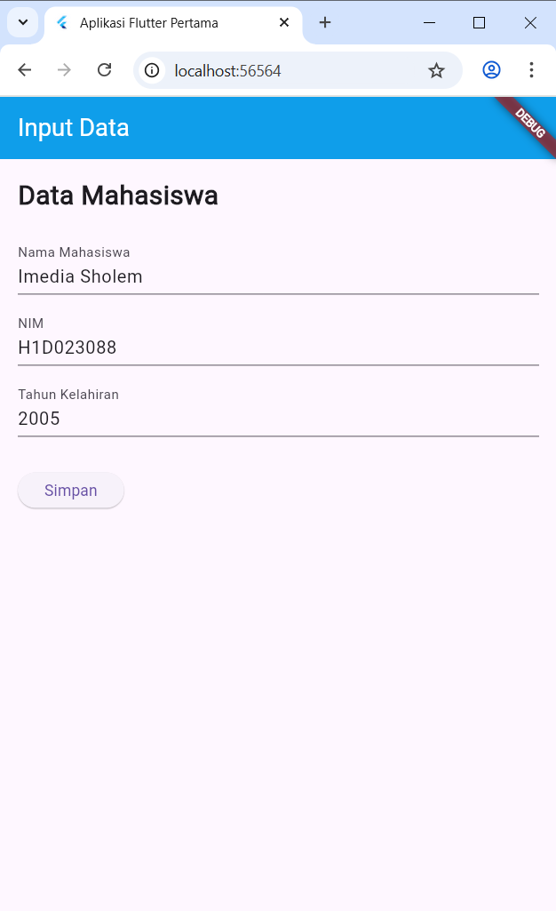
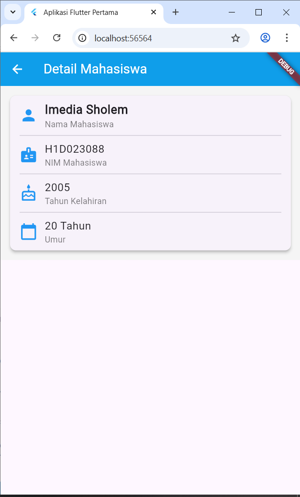

# Tugas 6
```
Nama    : Imedia Sholem Shoukat
NIM     : H1D023088
Shift   : A
```

## Penjelasan
Passing data adalah proses mengirimkan informasi (seperti teks dari form) dari satu halaman (widget) ke halaman lain (widget) saat navigasi, biasanya dengan memasukkan data tersebut ke dalam constructor halaman tujuan.

### Alur Proses Pengiriman Data
Aplikasi ini mendemonstrasikan alur passing data dasar di Flutter dari satu halaman (Form) ke halaman lain (Detail) menggunakan Constructor.

#### 1. Pengumpulan Data di `form.dart`
* Pengguna memasukan data ke dalam `TextField`
* Setiap `TextField` terhubung dengan sebuah `TextEditingController` (`_namaController`, `_nimController`, `_birthYearController`) yang menyimpan teks yang diinput.

```
// Di dalam class _FormInputState
final _namaController = TextEditingController();
final _nimController = TextEditingController();
final _birthYearController = TextEditingController();
```

#### 2. Ektrasi dan Persiapan Data `_tombolSimpan`
* Saat `ElevatedButton` "Simpan" ditekan, fungsi `onPressed` dieksekusi.
* Data diambil dari controller menggunakan properti `.text`.
* Data teks (String) diubah ke format yang diperlukan (misalnya, `int.tryParse` untuk tahun) dan data baru (seperti `age`) dihitung.

````
// Di dalam _tombolSimpan() -> onPressed
String NamaMahasiswa = _namaController.text;
String NIMMahasiswa = _nimController.text;
int? birthYear = int.tryParse(_birthYearController.text);
int age = DateTime.now().year - birthYear!;
````

#### 3. Navigasi dan Pengiriman Data `Navigator.push`
* Kita memanggil `Navigator.push` untuk membuka halaman baru.
* `MaterialPageRoute` digunakan untuk membangun (`builder`) halaman tujuan, yaitu `Mhs_Detail`.
* Di sini passing data terjadi. Kita membuat instance baru dari `Mhs_Detail` dan langsung memasukkan semua variabel (`NamaMahasiswa`, `NIMMahasiswa`, `birthYear`, `age`) ke dalam constructor-nya.

````
// di dalam onPressed pada form.dart
Navigator.of(context).push(MaterialPageRoute(
  builder: (context) => Mhs_Detail(
    // Data "dilempar" ke constructor Mhs_Detail
    NamaMahasiswa: NamaMahasiswa,
    NIMMahasiswa: NIMMahasiswa,
    birthYear: birthYear,
    age: age,
  ),
));
````

#### 4. Penerimaan Data di Halaman Detail (`detail.dart`)
* Class `Mhs_Detail` sudah dirancang untuk menerima data saat dibuat.
* Ia memiliki variabel final untuk setiap data yang akan diterima.
* Constructor `Mhs_Detail` menggunakan `required this.NamaMahasiswa`, dll. untuk "menangkap" data yang dilempar oleh `Navigator` dan menyimpannya ke dalam variabel final tersebut.
````
// Di dalam file detail.dart class Mhs_Detail
class Mhs_Detail extends StatelessWidget {
  // 1. Variabel untuk "menampung" data yang diterima
  final String NamaMahasiswa;
  final String NIMMahasiswa;
  final int birthYear;
  final int age;

  // 2. Constructor yang "menangkap" data
  const Mhs_Detail({
    super.key,
    required this.NamaMahasiswa,
    required this.NIMMahasiswa,
    required this.birthYear,
    required this.age,
  });

  // ... build method ...
}
````

#### Penampilan Data
* Di dalam method build `Mhs_Detail`, data yang sudah tersimpan di variabel `final` (seperti `NamaMahasiswa`, `age`, dll.) tinggal dipanggil dan ditampilkan di dalam widget `Text`, `ListTile`, atau `Card`.

````
// Di dalam method build() Mhs_Detail
@override
Widget build(BuildContext context) {
  return Scaffold(
    body: Card(
      // 3. Data yang sudah diterima kini ditampilkan
      child: ListTile(
        title: Text(NamaMahasiswa),
        subtitle: Text('Umur: $age tahun'),
      ),
    ),
  );
}
````

## Screenshoot

